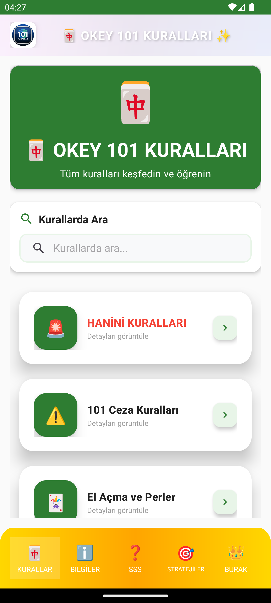
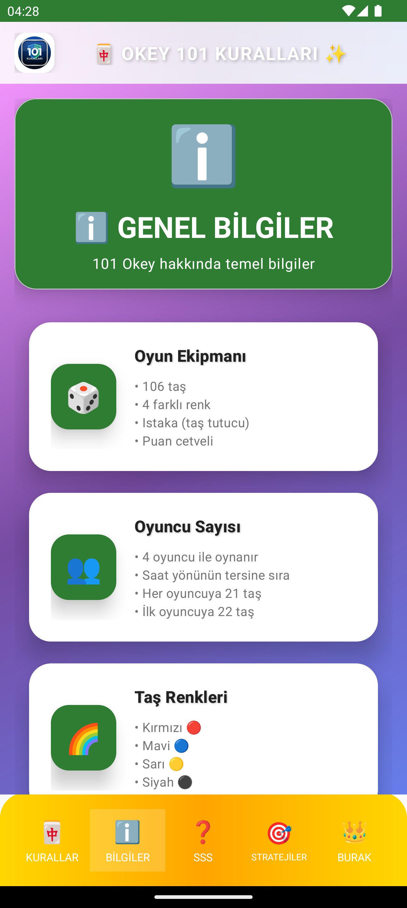
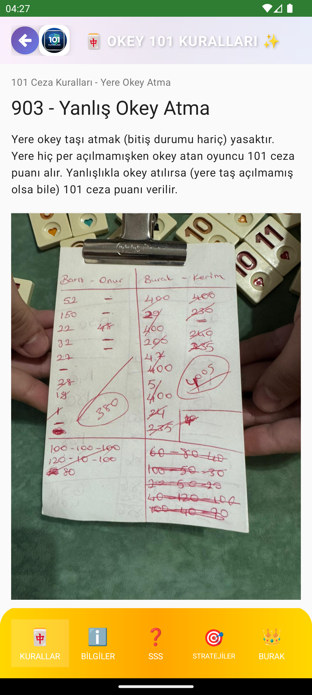

# 🎯 Okey 101 Kural Rehberi

<div align="center">
  
</div>

## 📱 Hakkında

Okey 101 Kural Rehberi, Okey oyununun tüm kurallarını içeren, tamamen çevrimdışı çalışan Android uygulamasıdır. Modern Material Design 3 tasarımı ile kullanıcı dostu bir arayüz sunar.

## ✨ Özellikler

- 🔍 **Hızlı Arama**: Kuralları anında bulun
- 📚 **Kategorize Edilmiş İçerik**: Kurallar kategorilere göre düzenlenmiş
- 📱 **Çevrimdışı Çalışma**: İnternet bağlantısı gerektirmez
- 🎨 **Modern Tasarım**: Material Design 3 ile güncel arayüz
- ⚡ **Hızlı Performans**: Optimize edilmiş veritabanı yapısı
- 🌙 **Karanlık Tema Desteği**: Sistem temasına uyumlu
- ⚙️ **Ayarlar Menüsü**: Kişiselleştirilebilir deneyim
- 📊 **İstatistikler**: Oyun performansınızı takip edin
- 🎮 **Strateji Rehberi**: Okey oyunu için ipuçları ve stratejiler
- ❓ **SSS Bölümü**: Sık sorulan sorular ve cevapları
- 🔄 **Otomatik Güncellemeler**: Yeni özellikler için bildirimler
- 📱 **Responsive Tasarım**: Tüm ekran boyutlarına uyumlu
- 🎯 **Gelişmiş Navigasyon**: Daha kolay gezinme deneyimi

## 🛠️ Teknolojiler

- **Dil**: Kotlin
- **Mimari**: MVVM (Model-View-ViewModel)
- **Veritabanı**: Room Database
- **Dependency Injection**: Hilt
- **Navigation**: Navigation Component
- **UI**: ViewBinding, Material Design 3
- **Asenkron İşlemler**: Coroutines
- **Animasyonlar**: Modern geçiş efektleri
- **State Management**: LiveData, StateFlow
- **Image Loading**: Optimized resource handling

## 📦 Kurulum

### Gereksinimler
- Android Studio Arctic Fox veya üzeri
- Android SDK 21+ (Android 5.0+)
- Kotlin 1.8+

### Adımlar
1. Projeyi klonlayın:
   ```bash
   git clone https://github.com/kerimayvaz77/okey-101-kurallari.git
   ```

2. Android Studio'da projeyi açın

3. Gradle Sync işlemini tamamlayın

4. Uygulamayı çalıştırın

## 🏗️ Proje Yapısı

```
app/
├── src/main/
│   ├── java/com/example/okey101rules/
│   │   ├── data/           # Veri katmanı (Room, Repository)
│   │   ├── ui/             # UI katmanı (Fragment, Activity)
│   │   │   ├── home/       # Ana ekran
│   │   │   ├── category/   # Kategori detayları
│   │   │   ├── detail/     # Kural detayları
│   │   │   ├── search/     # Arama sonuçları
│   │   │   ├── faq/        # SSS bölümü
│   │   │   ├── strategy/   # Strateji rehberi
│   │   │   ├── info/       # Genel bilgiler
│   │   │   └── settings/   # Ayarlar menüsü
│   │   ├── util/           # Yardımcı sınıflar
│   │   └── di/             # Dependency Injection
│   ├── res/                # Kaynaklar (layout, drawable, values)
│   └── assets/             # Statik dosyalar (JSON, görseller)
```

## 📱 Ekran Görüntüleri

<div align="center">
  
  
  
</div>

## 🚀 Versiyon Geçmişi

### v3.0 (Güncel)
- 🎉 Büyük güncelleme! Yeni özellikler ve iyileştirmeler
- 🔄 Geliştirilmiş otomatik güncelleme sistemi
- 📱 Daha iyi responsive tasarım ve kullanıcı deneyimi
- 🎯 Yenilenmiş navigasyon sistemi
- ⚡ Önemli performans optimizasyonları
- 🎨 Modern UI/UX iyileştirmeleri
- 🐛 Kritik hata düzeltmeleri
- 📊 Geliştirilmiş istatistik ve analitik sistemi
- 🔍 Daha akıllı arama algoritması
- 🌟 Yeni özellikler ve kullanıcı geri bildirimleri

### v2.6
- 🔄 Otomatik güncelleme bildirimleri
- 📱 Responsive tasarım iyileştirmeleri
- 🎯 Gelişmiş navigasyon sistemi
- ⚡ Performans optimizasyonları
- 🎨 UI/UX iyileştirmeleri
- 🐛 Hata düzeltmeleri
- 📊 Geliştirilmiş istatistik sistemi

### v2.18
- ⚙️ Yeni ayarlar menüsü eklendi
- 📊 İstatistik takip sistemi
- 🎮 Geliştirilmiş strateji rehberi
- 🔍 Geliştirilmiş arama algoritması
- 🎨 UI/UX iyileştirmeleri
- ⚡ Performans optimizasyonları
- 🐛 Hata düzeltmeleri

### v2.0
- ✨ Yeni Material Design 3 arayüzü
- 🔍 Geliştirilmiş arama fonksiyonu
- 📱 Bottom Navigation ile kolay gezinme
- ⚡ Performans iyileştirmeleri
- 🐛 Hata düzeltmeleri

### v1.0
- 🎉 İlk sürüm
- 📚 Temel kural listesi
- 🔍 Basit arama özelliği

## 📋 Özellik Detayları

### 🎯 Ana Özellikler
- **101 Kural**: Okey oyununun tüm kuralları detaylı açıklamalarla
- **Kategori Sistemi**: Kurallar mantıklı kategorilere ayrılmış
- **Arama**: Anlık arama ile istediğiniz kuralı bulun
- **Favoriler**: Sık kullandığınız kuralları işaretleyin

### 🎮 Oyun Rehberi
- **Strateji İpuçları**: Oyun stratejileri ve taktikleri
- **SSS**: Sık sorulan sorular ve detaylı cevapları
- **Genel Bilgiler**: Okey oyunu hakkında temel bilgiler

### ⚙️ Kişiselleştirme
- **Tema Seçimi**: Açık/koyu tema desteği
- **Font Boyutu**: Okunabilirlik için ayarlanabilir font
- **Bildirimler**: Önemli güncellemeler için bildirimler
- **Responsive Tasarım**: Tüm cihazlarda mükemmel görünüm

## 🤝 Katkıda Bulunma

1. Bu repository'yi fork edin
2. Yeni bir branch oluşturun (`git checkout -b feature/yeni-ozellik`)
3. Değişikliklerinizi commit edin (`git commit -m 'Yeni özellik eklendi'`)
4. Branch'inizi push edin (`git push origin feature/yeni-ozellik`)
5. Pull Request oluşturun

## 📄 Lisans

Bu proje MIT lisansı altında lisanslanmıştır. Detaylar için [LICENSE](LICENSE) dosyasına bakın.

## 📞 İletişim

Sorularınız veya önerileriniz için:
- 📧 Email: [kerimayvaz7@gmail.com]
- 🐛 Bug Report: [Issues](https://github.com/kerimayvaz77/okey-101-kurallari/issues)
- 💬 Discussions: [GitHub Discussions](https://github.com/kerimayvaz77/okey-101-kurallari/discussions)

## ⭐ Beğendiyseniz

Bu projeyi beğendiyseniz yıldız vermeyi unutmayın! ⭐

## 🏆 Katkıda Bulunanlar

Bu projeye katkıda bulunan herkese teşekkürler! 🙏

---

<div align="center">
  <p><strong>Okey 101 Kural Rehberi v3.0</strong></p>
</div>